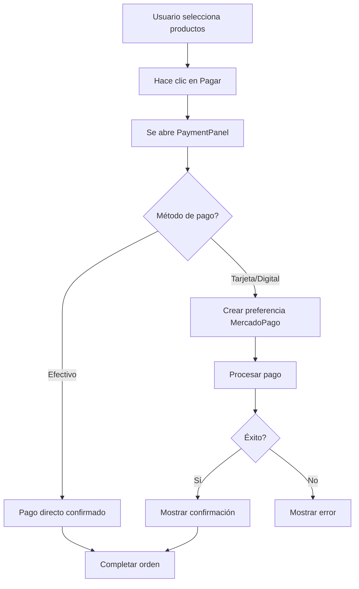

# 💳 Integración de MercadoPago

## Descripción General

Este proyecto ahora utiliza MercadoPago como plataforma de pagos, reemplazando la integración anterior con Clip. MercadoPago ofrece una solución completa para procesar pagos con tarjeta, efectivo y métodos digitales.

## 🚀 Configuración Rápida

### 1. Obtener Credenciales de MercadoPago

#### ⭐ Para PRUEBAS (Sandbox)
1. Ve a: https://www.mercadopago.com.mx/developers
2. En **Credenciales de prueba** encontrarás:
   - `TEST-` + Public Key
   - `APP_USR-` + Access Token (TEST)

#### Para PRODUCCIÓN
1. En **Credenciales activas** encontrarás:
   - `APP_USR-` + Public Key
   - `APP_USR-` + Access Token (PRODUCTIVO)

**⚠️ IMPORTANTE**: Para desarrollo usa TEST, para producción usa APP_USR

### 2. Configurar Variables de Entorno

Edita `.env.local`:

```bash
# OPCIÓN 1: Credenciales TEST (Sandbox) ⭐ Úsalas para empezar
VITE_MERCADOPAGO_PUBLIC_KEY=TEST-abc123def456ghi789
VITE_MERCADOPAGO_ACCESS_TOKEN=APP_USR-123456789-test-token

# App URL
VITE_APP_URL=http://localhost:5173
VITE_APP_ENV=development
```

**Tarjetas de prueba (Sandbox)**:
- Visa: 4509 9535 6623 3704 | 11/25 | CVV: 123
- Master: 5031 7557 3453 0604 | 11/25 | CVV: 123
- Amex: 3711 803032 57522 | 11/25 | CVV: 123

### 3. Instalar Dependencias

```bash
npm install mercadopago @mercadopago/sdk-react
```

## 📦 Estructura de Archivos

```
src/
  services/
    mercadopagoService.ts    # Servicio principal de MercadoPago
  components/
    pos/
      PaymentPanel.tsx       # Panel de pago integrado con MercadoPago
```

## 🔧 Funcionalidades Implementadas

### 1. Servicio de MercadoPago (`mercadopagoService.ts`)

El servicio incluye las siguientes funciones:

#### `createPaymentPreference()`
Crea una preferencia de pago que genera un link de checkout.

```typescript
const preference = await mercadopagoService.createPaymentPreference({
  amount: 1000.00,
  description: "Mesa 5 - Orden 12345",
  orderId: "order-12345",
  email: "customer@email.com"
})

// Retorna: { id, init_point, sandbox_init_point }
```

#### `processDirectPayment()`
Procesa un pago directo (requiere terminal configurado).

```typescript
const payment = await mercadopagoService.processDirectPayment({
  amount: 1000.00,
  description: "Mesa 5 - Orden 12345",
  orderId: "order-12345",
  paymentMethodId: "visa"
})
```

#### `getPaymentStatus()`
Consulta el estado de un pago existente.

```typescript
const status = await mercadopagoService.getPaymentStatus(paymentId)
console.log(status.status) // 'approved', 'pending', 'rejected'
```

#### `cancelPayment()`
Cancela un pago pendiente.

```typescript
const cancelled = await mercadopagoService.cancelPayment(paymentId)
```

### 2. Panel de Pago (`PaymentPanel.tsx`)

Componente rediseñado con:
- ✅ Integración con MercadoPago
- ✅ Soporte para efectivo, tarjeta y pagos digitales
- ✅ Cálculo de propina (0%, 10%, 15%, 20% o personalizada)
- ✅ Diseño moderno con gradientes y animaciones
- ✅ Estados de carga y éxito visuales
- ✅ Manejo de errores mejorado

## 🎨 Mejoras de UI

El proyecto ha sido rediseñado con un estilo moderno inspirado en vikingosPOS:

### Componentes Actualizados

1. **ProductGrid** - Cards de productos con:
   - Gradientes por categoría
   - Indicadores de stock visuales
   - Efectos hover suaves
   - Badges de categoría coloridos

2. **OrderPanel** - Panel de orden con:
   - Diseño más limpio y espacioso
   - Controles de cantidad mejorados
   - Subtotales por producto
   - Iconos lucide-react

3. **CartSummary** - Resumen con:
   - Gradientes en totales
   - Alertas de stock mejoradas
   - Botón de envío destacado
   - Mejor jerarquía visual

4. **PaymentPanel** - Panel de pago con:
   - Header con gradiente
   - Botones de método de pago mejorados
   - Animaciones suaves
   - Estados visuales claros

### Estilos Globales Mejorados

- Gradientes de fondo sutiles
- Scrollbar personalizado con gradiente
- Animaciones: fadeIn, slideIn, scaleIn, shimmer
- Clases utility modernas
- Efectos glassmorphism
- Gradientes de texto
- Sombras mejoradas

## 🔄 Flujo de Pago



## 📱 Métodos de Pago Soportados

- 💵 **Efectivo**: Procesamiento inmediato
- 💳 **Tarjeta**: Visa, Mastercard, American Express
- 📱 **Digital**: Transferencias y billeteras digitales

## 🔐 Seguridad

- ✅ Tokens de acceso en variables de entorno
- ✅ Validación de montos
- ✅ Idempotency keys para evitar pagos duplicados
- ✅ Webhooks para confirmación de pagos (pendiente de implementar)

## 🧪 Pruebas Prácticas

Ver documentación completa de testing: [MERCADOPAGO_TESTING.md](./MERCADOPAGO_TESTING.md)

**Checklist rápido**:
- [ ] Credenciales TEST en `.env.local`
- [ ] `npm install` completado
- [ ] `npm run dev` ejecutándose
- [ ] Login y agregar productos
- [ ] Pago en efectivo funciona
- [ ] Propina se calcula correctamente

## 🚧 Roadmap de Integración

### v2.1 (Próximo)
1. **Checkout Pro Embebido**
   - Formulario de pago integrado
   - Sin redirigir a MercadoPago

### v2.2
1. **Webhooks de MercadoPago**
   - Confirmación automática de pagos
   - Actualizar órdenes en tiempo real

2. **Cloud Functions Backend**
   - Procesar pagos de forma segura
   - Mayor seguridad del token

### v3.0
1. **Terminales Físicas** (NEWLAND_N950, PAX_A910)
2. **Dashboard de Transacciones**
3. **Sistema de Reembolsos**

## 📚 Documentación y Recursos

### Del Proyecto
- [Guía Completa de Testing](./MERCADOPAGO_TESTING.md) ⭐ **Comienza aquí**
- [Guía de Integración](./MERCADOPAGO_INTEGRATION.md) (este archivo)

### De MercadoPago
- [Panel Desarrolladores](https://www.mercadopago.com.mx/developers)
- [API Reference](https://www.mercadopago.com.mx/developers/es/reference)
- [Checkout Pro](https://www.mercadopago.com.mx/developers/es/docs/checkout-pro/landing)
- [Terminal Física API](https://www.mercadopago.com.mx/developers/es/docs/point/landing)

## 🆘 Soporte

Ver [MERCADOPAGO_TESTING.md#-troubleshooting](./MERCADOPAGO_TESTING.md) para problemas comunes

## 🔄 Migración desde Clip

Si anteriormente usabas Clip:

1. Las funciones de pago ya han sido actualizadas
2. El servicio `clipService.ts` puede ser removido o guardado como backup
3. Actualiza las Cloud Functions si procesabas pagos en el backend
4. Actualiza las referencias a Clip en la documentación

---

**Nota**: Este documento será actualizado conforme se agreguen más funcionalidades.
